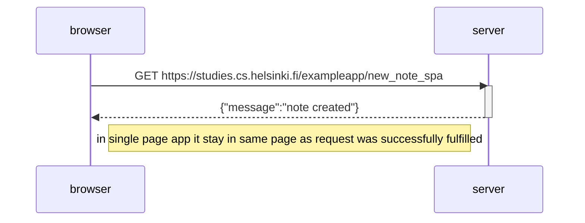

```mermaid
sequenceDiagram
    participant browser
    participant server

    browser->>server: GET https://studies.cs.helsinki.fi/exampleapp/new_note_spa
    activate server
    server-->>browser: {"message":"note created"}
    deactivate server
    Note right of browser: in single page app it stay in same page as request was successfully fulfilled

```
